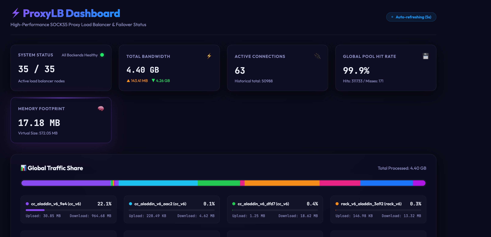

## ProxyLB 

A proxy loadbalancer with SOCKS5 and Shadowsocks protocol support. It is designed to be used as a proxy with multiple backends, and it supports load balancing, health checking, and connection pooling.

### Features

* SOCKS5 inbound support.
* Shadowsocks inbound support.
* HTTP inbound support.
* Multiple backends (socks5 over TCP or Unix domain socket)
* Load balancing with strategy: urltest,failover,roundrobin with least history connections
    ```
    Note: currently, only global strategy of failover is supported, group strategy will be added in the future. Group cannot be nested.

    For example, the backend selection logic could be like: GroupA (the first group in failover list)->Backend1 in GroupB (GroupB can be failover,urltest,roundrobin)
    ```
* Health checking.
* Stats collection for each inbound and each backend, with restful api and a simple web frontend.
* Highly performant with async and Tokio. The workers arec completely lockless.
* With support for backend connection pool, this can reduce backend tcp handshake latency.

### Usage

```bash
proxylb -c config.yaml
```

### Web

